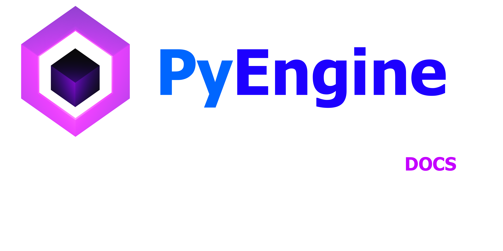

        

   <h1 align="center">PyEngine Studio Documentation</h1>

This is the code of the documentation website of PyEngine Studio Beta 1

    <h1 align="left">Links</h1>

<a href="https://artos-developper.github.io/PyEngineStudio-Docs" target="_blank">View Documentation</a>

<a href="https://github.com/ArtOS-Developper/PyEngineStudio" target="_blank">Download PyEngine Studio</a>

<a href="https://github.com/ArtOS-Developper/PyEngineStudio/relases" target="_blank">Download Offline Documentation</a>
